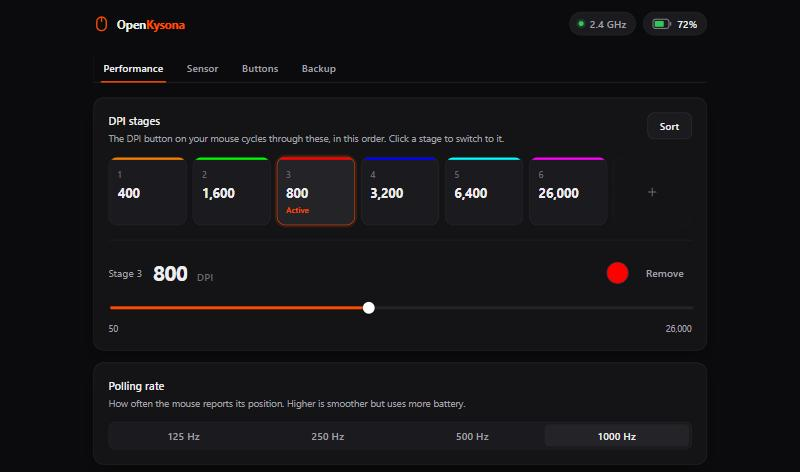

# OpenKysona

A lightweight, open-source replacement for the Kysona M600 V2 mouse software.
It runs in your browser, works offline, and installs nothing.



**[Open OpenKysona →](https://leoben49.github.io/OpenKysona/)**

## Why

The official app is a heavy Windows program that hides the battery percentage.
OpenKysona is a single ~100 KB web page that talks to the mouse directly over
[WebHID](https://developer.mozilla.org/docs/Web/API/WebHID_API). Every setting is
saved **on the mouse itself**, so once you've configured it you can close the
page. Nothing runs in the background and nothing starts with Windows.

## Features

- **Battery**: percentage, charging state and voltage
- **DPI**: up to 8 stages from 50 to 26,000 DPI, stage colours, sort, undo
- **Polling rate**: 125 / 250 / 500 / 1000 Hz
- **Sensor**: lift-off distance, motion sync, ripple control, angle snapping,
  high-performance mode, peak performance, debounce time
- **Buttons**: remap all six buttons (mouse buttons, DPI, scroll, polling rate, disable)
- **Macros**: record keys (including Ctrl/Shift/Alt/Win) and clicks with real
  timing, edit delays, and choose run N times / repeat while held / toggle
- **Backup & restore** your settings to a file
- **Light and dark** themes, following your system setting

## Using it

1. Open **[leoben49.github.io/OpenKysona](https://leoben49.github.io/OpenKysona/)** in
   Chrome, Edge, Brave or another Chromium browser on desktop. Firefox and Safari
   don't support WebHID.
2. Plug in the 2.4 GHz receiver or the USB cable and click **Connect mouse**.

To use it fully offline, download `openkysona.html` from the
[latest release](https://github.com/leoben49/OpenKysona/releases/latest) and open
it from disk. It's the same page in a single self-contained file.

**Connections:** settings can be changed over the 2.4 GHz receiver or the USB
cable. The mouse doesn't accept configuration over Bluetooth, but everything you
set still applies there, and Windows shows the battery level under
*Settings → Bluetooth & devices*.

**Privacy:** the page makes no network requests. There's no analytics,
telemetry or update check, and a Content Security Policy blocks connections to
other sites.

## Supported devices

| Device | Status |
|---|---|
| Kysona M600 V2 (receiver `3554:F5D5`, cable `3554:F57D`) | Tested |

Other Kysona mice built on the same Compx platform (M600, M511, Aztec) are listed
by the official driver and probably work, but haven't been tested. Reports are
welcome.

## Development

```bash
npm install
npm run dev      # http://localhost:5173  (add ?fake to use a simulated mouse)
npm test         # protocol tests built from real device data
npm run check    # type-check
npm run build    # single-file build in dist/index.html
```

The protocol is documented in [docs/PROTOCOL.md](docs/PROTOCOL.md).

## Credits

The protocol is shared with the Redragon G49/M916 Pro, documented by
[m916proui](https://github.com/dongkid/m916proui) (MIT). The Kysona-specific
details (config channel, settings registers, macro encoding and write behaviour)
were worked out on a real M600 V2.

## Disclaimer

OpenKysona is an independent project, not affiliated with or endorsed by Kysona.
"Kysona" is used only to say which hardware this works with. Writing settings
uses the same commands as the official software, but use it at your own risk.

## License

[MIT](LICENSE)
